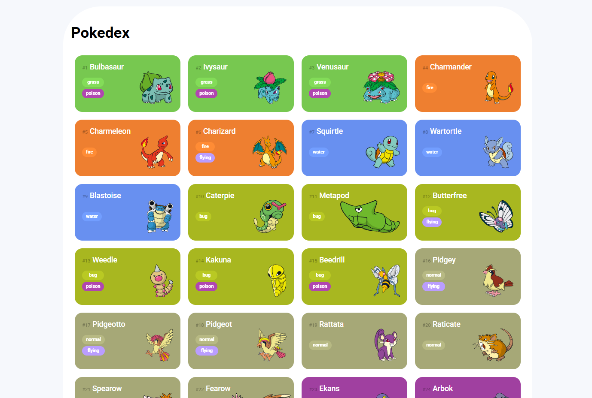
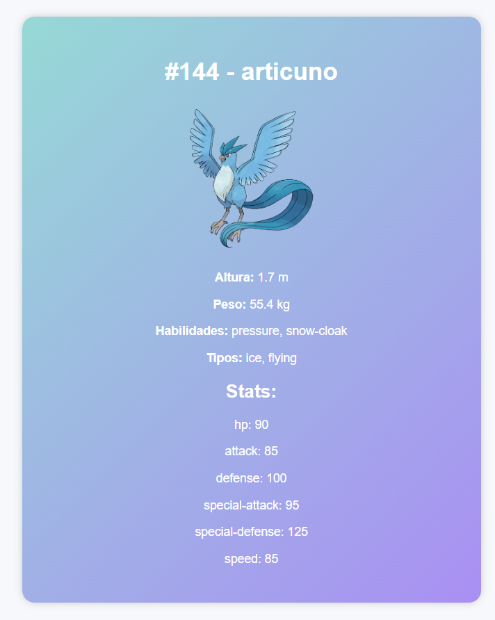

# Pokédex Dinâmica: Consumo e Manipulação de APIs REST

Este projeto é uma **Pokédex interativa** desenvolvida como parte dos meus estudos de Front-End, com foco principal no **consumo e tratamento de dados assíncronos** provenientes de uma API externa.

---

## Objetivo Técnico e Arquitetura de Dados

O projeto demonstrou a capacidade de interagir com serviços externos, simulando o comportamento de um Front-End que se comunica com uma API Back-End.

Os pontos técnicos focados foram:

1.  **Comunicação Assíncrona:** Utilização de **JavaScript (Fetch API)** para realizar requisições assíncronas ao serviço **PokéAPI**.
2.  **Arquitetura de Dados:** Tratamento e mapeamento dos dados brutos recebidos da API (JSON) para um modelo de objeto limpo e estruturado (necessário para a exibição de listas e detalhes).
3.  **Controle de Fluxo:** Implementação de **Paginação (Load More)** para gerenciar a quantidade de dados exibidos e otimizar a performance da interface.
4.  **Manipulação de DOM:** Injeção dinâmica de elementos HTML e CSS para renderizar a listagem e as páginas de detalhes.

---

## Funcionalidades e Inovação

Este projeto foi estendido com melhorias de usabilidade e interface:

* **Página de Detalhes Completa (Feature Adicional):** Criação de uma interface dedicada para exibir altura, peso, habilidades e *stats* do Pokémon, exigindo múltiplas chamadas de API e manipulação de dados complexos.
* **Design Contextual:** Cores e gradientes dinâmicos de fundo aplicados aos cards e à página de detalhes com base nos tipos do Pokémon (Lógica de Mapeamento).
* **Usabilidade:** Layout responsivo e adaptado para dispositivos móveis e Paginação controlada pelo usuário.

---

## Preview

### Página Principal:

### Detalhes do Pokémon:

---

## Tecnologias utilizadas

* **JavaScript (ES6+):** Lógica, assincronicidade e manipulação de API (Fetch).
* **HTML5:** Estrutura semântica.
* **CSS3:** Design Responsivo (media queries) e estilização dinâmica.
* **PokéAPI:** Consumo de serviço **API REST** externo.
